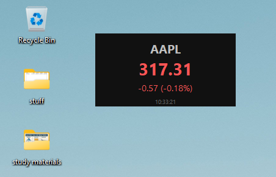

# Stock Widget

A lightweight desktop stock ticker widget built with **Python**, **CustomTkinter**, and **Yahoo Finance**.

The widget displays the current market price of a stock, the daily price change, and the percentage change in a clean, frameless desktop window. It is designed to stay on top of other windows and can be freely moved around the screen.



---

## Features

* Live stock prices from Yahoo Finance
* Daily price change (absolute and percentage)
* Automatic refresh every 5 seconds
* Frameless, draggable desktop widget
* Always-on-top window
* Minimal dark theme
* Hover-to-show close button
* Launch with any ticker symbol from the command line

---

## Requirements

* Python 3.10+
* Internet connection

Install the required packages:

```bash
pip install -r requirements.txt
```

or

```bash
pip install customtkinter yfinance
```

---

## Usage

The widget accepts a ticker symbol as a command-line argument.

Examples:

```bash
pythonw widget.py AAPL
```

```bash
pythonw widget.py NVDA
```

```bash
pythonw widget.py SAP.DE
```

```bash
pythonw widget.py BTC-USD
```

### Why `pythonw`?

It is recommended to launch the widget using **`pythonw`** instead of `python`.

`pythonw` runs the application **without opening a console window**, allowing the widget to behave like a native desktop application. You can immediately continue using the same Command Prompt to launch additional widgets.

For example:

```bash
pythonw widget.py AAPL
pythonw widget.py NVDA
pythonw widget.py MSFT
```

Each command opens an independent widget while the terminal remains available.

---

## Supported Tickers

The widget supports any ticker available through Yahoo Finance.

Examples:

| Asset     | Ticker    |
| --------- | --------- |
| Apple     | `AAPL`    |
| Microsoft | `MSFT`    |
| Siemens   | `SIE.DE`  |
| USD/EUR   | `EUR=X`   |
| USD/JPY   | `JPY=X`   |
| Bitcoin   | `BTC-USD` |
| DAX K     | `^GDAXIP` |
| VTI       | `VTI`     |
| S&P 500   | `^GSPC`   |

Hint: Yahoo Finance indices often start with `^`. When using Windows Command Prompt, the caret (`^`) is a special escape character. To pass it correctly to the script, escape it by adding another caret:

```bash
pythonw widget.py ^^GDAXIP
pythonw widget.py ^^GSPC
```
---

## Project Structure

```
stock-widget/
│
├── widget.py
├── requirements.txt
├── README.md
├── LICENSE
└── screenshots/
```

---

## License

This project is licensed under the MIT License.
